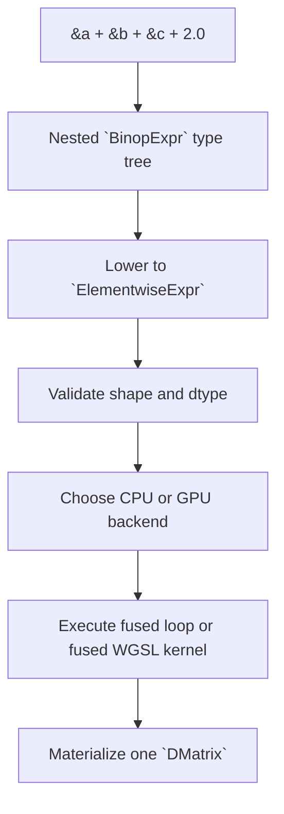
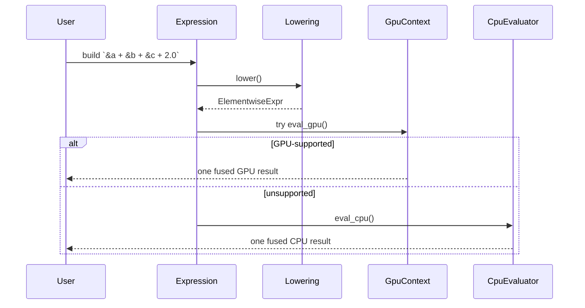

# Lowering Lazy Expressions to a GPU-Evaluable Plan

The current expression-template system is good at delaying work, but it is not yet shaped for backend selection.

Today, the nested type structure is the evaluator. `BinopExpr` recursively implements `IndexValue<usize>`, and materialization walks the final expression one index at a time on CPU; see [src/expression/binary_expr.rs](../../src/expression/binary_expr.rs#L108) and [src/dmatrix/mod.rs](../../src/dmatrix/mod.rs#L163).

That works well for a CPU pull-based evaluator, but it does not provide a natural place to:

- inspect the whole expression,
- choose CPU vs GPU,
- emit one fused kernel,
- cache compiled pipelines,
- reason about unsupported nodes or scalar types.

## Main Design Move

Keep the current operator-overloaded expression construction, but add a lowering step before evaluation.

Instead of evaluating `BinopExpr` directly, lower it into a small runtime IR:

```rust
pub enum ExprNode<'a> {
    Matrix(&'a DMatrix<f32>),
    Scalar(f32),
    Add(Box<ExprNode<'a>>, Box<ExprNode<'a>>),
    Sub(Box<ExprNode<'a>>, Box<ExprNode<'a>>),
    Mul(Box<ExprNode<'a>>, Box<ExprNode<'a>>),
    Div(Box<ExprNode<'a>>, Box<ExprNode<'a>>),
}

pub struct ElementwiseExpr<'a> {
    pub root: ExprNode<'a>,
    pub nrows: usize,
    pub ncols: usize,
}
```

The important change is not the exact enum shape. The important change is that evaluation becomes:

1. lower the Rust type-level expression into runtime IR,
2. validate it,
3. pick a backend,
4. execute it with one output allocation.

## Why Lowering Is Necessary

Without lowering, the GPU path has no easy way to see that

```rust
(&a + &b + &c + 2.0)
```

is one fused elementwise expression. It only sees nested generic types.

With lowering, the runtime can inspect the complete tree and produce a fused scalar program:

$$
\mathrm{out}[i] = a[i] + b[i] + c[i] + 2.0
$$

That preserves the "no temporary matrices" advantage already intended by the expression-template design.

## Lowering Model

Each current `BinopExpr<A, B, T, Op>` should lower recursively:

- lower `A` into a left `ExprNode`,
- lower `B` into a right `ExprNode`,
- map `Op` to `Add`, `Sub`, `Mul`, or `Div`,
- preserve the expression shape and output dimensions.

Leaves become:

- matrix references,
- mutable matrix references reborrowed as immutable views,
- scalar values.

This means the current operator code remains largely intact while the evaluation layer changes.



## CPU and GPU Can Share the Same IR

Once lowering exists, CPU and GPU backends become sibling evaluators:

- CPU evaluator: interpret the IR per index.
- GPU evaluator: emit WGSL for the IR and dispatch one compute kernel.

That has two advantages:

- the fused-expression semantics stay identical across backends,
- unsupported GPU cases can fall back cleanly to CPU without rebuilding the public API.

## Worked Example

Take:

```rust
let expr = &a + (&b * &c) - 2.0;
```

The lowered IR is conceptually:

```text
Sub(
    Add(
        Matrix(a),
        Mul(Matrix(b), Matrix(c)),
    ),
    Scalar(2.0),
)
```

The CPU evaluator computes:

$$
\mathrm{out}[i] = a[i] + b[i]c[i] - 2.0
$$

The GPU evaluator should emit the same fused scalar expression inside one WGSL kernel body:

```wgsl
out[idx] = a[idx] + (b[idx] * c[idx]) - 2.0;
```

The result is still:

- one output buffer,
- no intermediate matrices,
- one kernel launch for the whole chain.

## Suggested Evaluation API

The eventual internal shape can be:

```rust
pub trait EvaluateElementwise<'a> {
    fn lower(self) -> ElementwiseExpr<'a>;
}

impl GpuContext {
    pub async fn eval<'a>(
        &self,
        expr: impl EvaluateElementwise<'a>,
    ) -> Result<DMatrix<f32>, GpuError> {
        let lowered = expr.lower();
        self.eval_lowered(&lowered).await
    }
}
```

or, if keeping the evaluator more object-centric:

```rust
impl<'a> ElementwiseExpr<'a> {
    pub fn eval_cpu(&self) -> DMatrix<f32> { /* fused CPU loop */ }
    pub async fn eval_gpu(&self, gpu: &GpuContext) -> Result<DMatrix<f32>, GpuError> { /* WGSL */ }
}
```

The important public-facing choice is that backend selection happens at evaluation, not expression construction.

## WGSL Code Generation Scope

For the first version, WGSL generation should be intentionally small:

- scalar type: `f32`,
- operators: `+`, `-`, `*`, `/`,
- leaves: storage buffers and scalar literals,
- output: one storage buffer.

That is enough to support the existing elementwise expression family without promising generalized kernel compilation.

## Why Not Skip the IR and Special-Case Add?

A dedicated add kernel is fine as the first technical experiment, but it is not enough as the architectural answer.

If GPU support starts as ad hoc special cases, the crate will quickly end up with:

- one code path for `&a + &b`,
- a second for `&a + &b + &c`,
- another for scalar combinations,
- and no clear route to generic fused evaluation.

Lowering avoids that trap early.

## Failure and Fallback Rules

The lowered IR should be rejected for GPU execution when:

- the scalar type is not `f32`,
- shapes are incompatible,
- the expression contains a node not supported by the GPU code generator,
- no suitable adapter or device is available.

In those cases, the same lowered IR can still execute on CPU.



## Recommended Internal Milestones

1. Add lowering for `DMatrix<f32>` elementwise expressions only.
2. Add a fused CPU evaluator over the new IR.
3. Add WGSL code generation for `Add/Sub/Mul/Div` plus scalar literals.
4. Add explicit `GpuContext` evaluation.
5. Add fallback from GPU to CPU using the same lowered IR.

## Source Links

- `wgpu` crate docs: <https://docs.rs/wgpu/latest/wgpu/>
- WGSL specification: <https://www.w3.org/TR/WGSL/>
